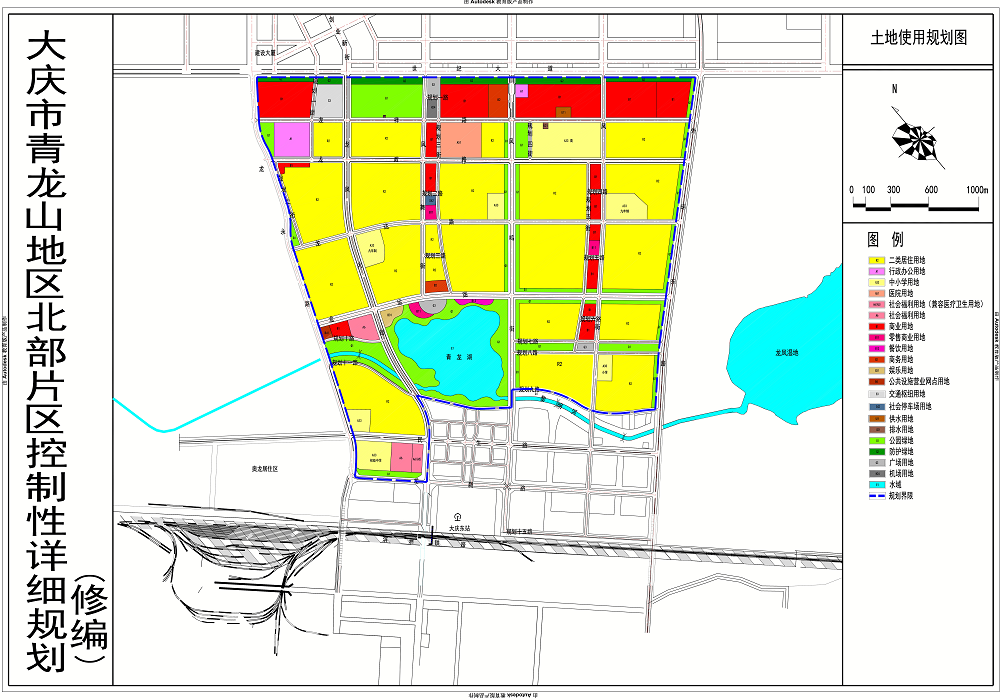
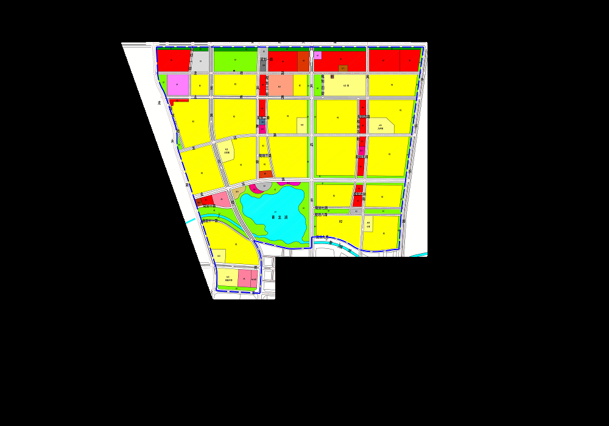
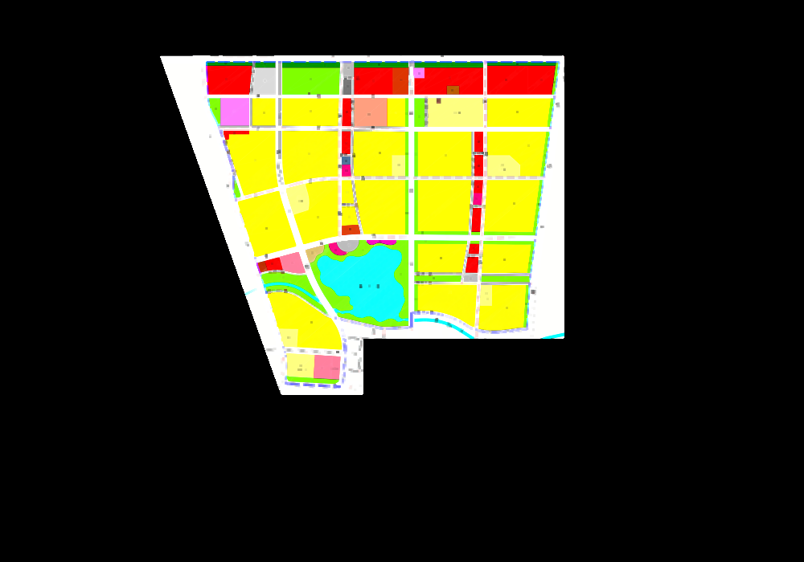
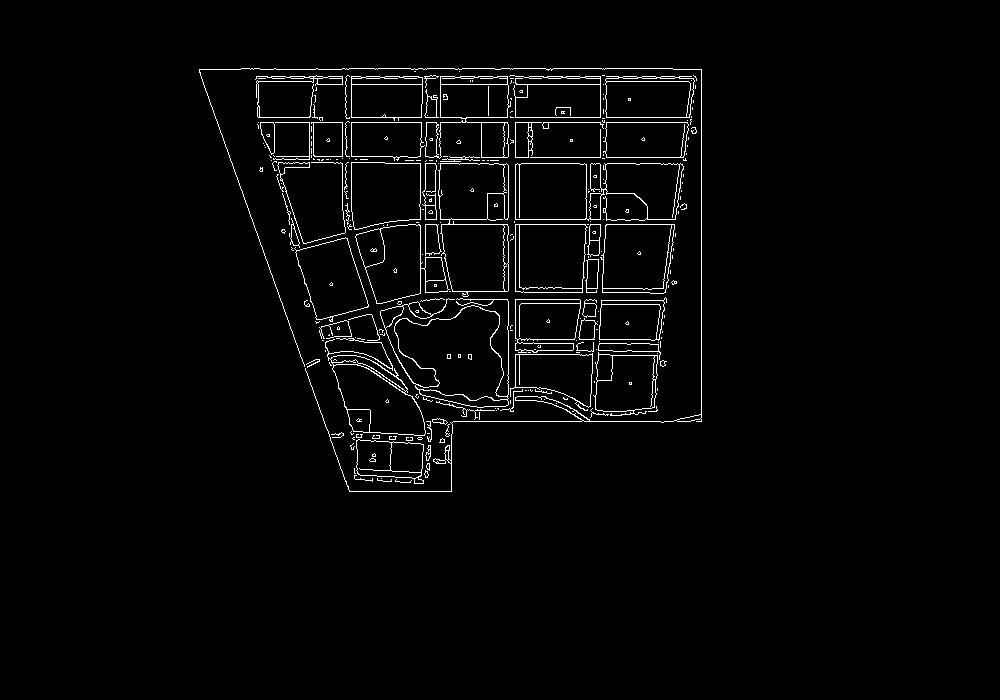
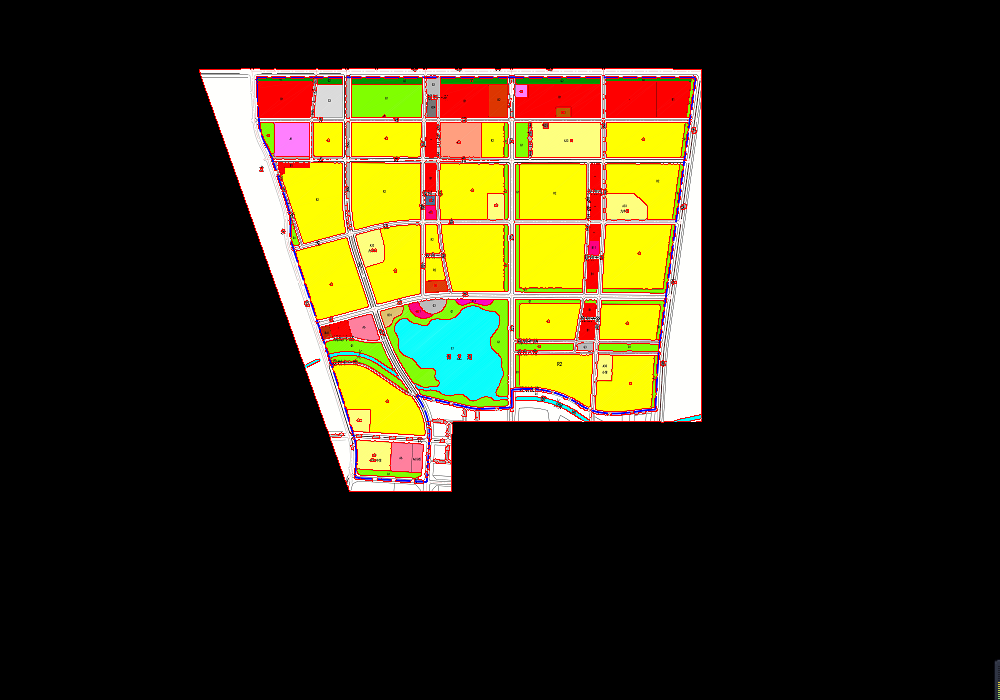
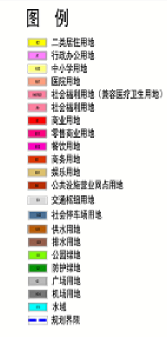

# 土地规划图转SVG实现过程

这个图一看就是要先做ROI，再去噪声，然后检查边缘，找出轮廓的。

### ROI

### 去噪声

### 边缘检测

### 轮廓

### 数据收集和计算

找到轮廓就好办了，计算面积，周长，坐标，颜色，都没问题

### 自动识别中文

未实现：自动识别每个图例颜色，标号，然后将图例颜色后的中文识别出来。

思路时有的：使用tessaract，默认是支持英文的，中文应该是要训练一下。暂时没空做这个了，可以手动做个颜色的Map先用着也是可以的。

[tessaract](https://blog.csdn.net/qq_43576028/article/details/102907722) 貌似比较旧了，还是那句话，使用python或者c++来做，java真的是资料太少。

