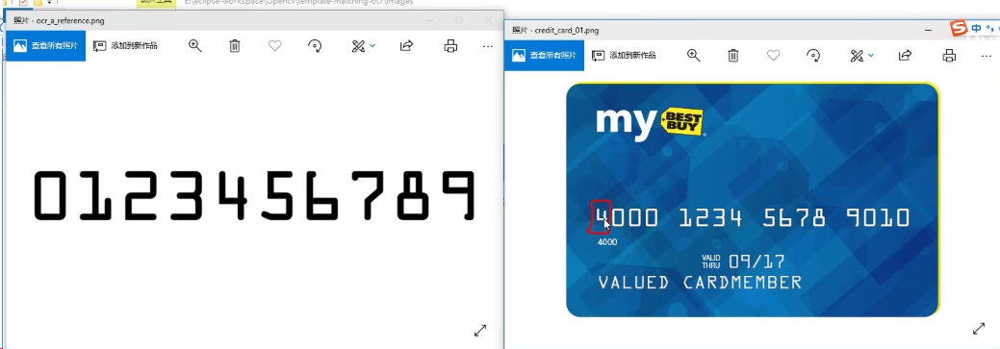
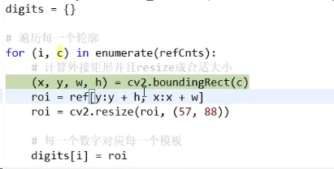
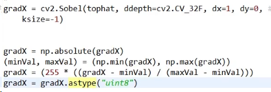

# 号码识别

## 大概流程

模板匹配

轮廓检测，将数字切割出来，作为模板

拿到轮廓，外接一个矩形

我们会拿到外轮廓和内轮廓，选择外轮廓，利用外轮廓做矩形

然后与图片卡进行模板匹配

模版 预处理

1 转灰度图

2 转二值

3 检测轮廓，算外接矩形，保存数字，按照轮廓的长宽比列过滤出来数字

4 第一个轮廓是大的轮廓，包含好几个数字，需要进一步细化轮廓

card 预处理

1. 灰度
2. 二值
3. tophat
4. 梯度 gradient
5. 闭操作完再闭操作，将白色连起来
6. 轮廓检测
7. 对每个轮廓进行处理 二值化处理，然后切分成每个小的区域
8. 每个小的区域与模版匹配了，就可以输出结果了

## OCR

[OCR是什么 ？](https://www.zhihu.com/question/34873811/answer/645053057)

OCR （Optical Character Recognition，光学字符识别）是指电子设备检查纸上打印的字符，通过检测暗、亮的模式确定其形状，然后用字符识别方法将形状翻译成计算机文字的过程。

**说白了就是识别图片上的文字，然后提取出来，变成可编辑的文档**

## 问题

https://www.bilibili.com/video/BV1PV411774y?p=38

这个roi的ref[y:y+h;x:x+w]是啥意思？这时py的快速使用roi的写法，因为python里把Mat当作一个二维矩阵，直接操作数组即可，java里mat.apply(rect)也是蛮轻松的。

https://www.bilibili.com/video/BV1PV411774y?p=39

1 myutils.resize方法里逻辑不知道？

应该是按照width来缩放，height自适应。

2 这里的sobel计算x没怎么看懂，老师是说值计算了x，y计算，因为只计算x的效果貌似好点

https://www.bilibili.com/video/BV1PV411774y?p=40&spm_id_from=pageDriver

1 ROI     mat.apply(rect)

https://github.com/bytedeco/javacv/issues/795

https://github.com/opencv/opencv/issues/9722

https://www.bilibili.com/video/BV1PV411774y?p=40&spm_id_from=pageDriver

`TM_CCORR` = Cross correlation

`TM_CCOEFF` = Correlation coefficient

https://stackoverflow.com/questions/55469431/what-does-the-tm-ccorr-and-tm-ccoeff-in-opencv-mean

何时取max何时取min？TM_CCORR， TM_CCOEFF 用max，其他用min

https://docs.opencv.org/3.4/df/dfb/group__imgproc__object.html#ga586ebfb0a7fb604b35a23d85391329be

